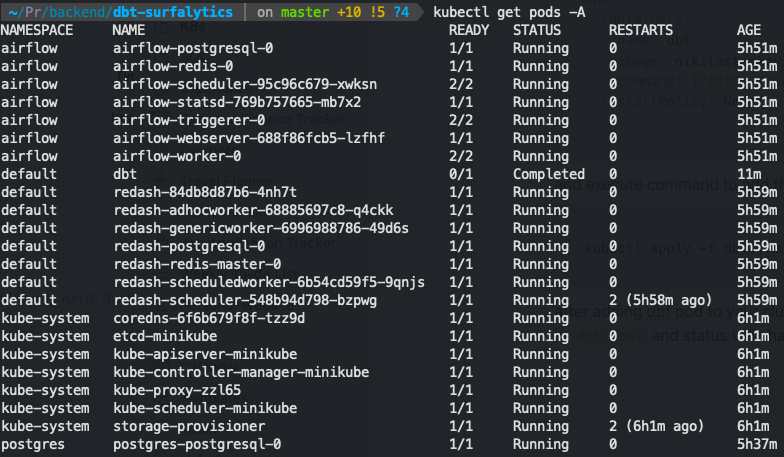

# K8s

(dbt, airflow, postgres, redash) inside your local `minikube` cluster

## Prerequisites

`heml`

`kubectl`

`minikube`

useful commands

```bash
minikube start --cpus 6 --memory 7997
minikube stop && minikube delete
kubectl delete pods --all -n default
kubectl get all
kubectl get pods -A # get all pods
kubectl logs $(pod_name) # logs
kubectl delete pods dbt
kubectl get pods -n default | grep ^airflow | awk '{print $1}' | xargs kubectl delete pod -n default
helm uninstall airflow --namespace airflow # stop and delete all pods
kubectl get configmap airflow-dags --namespace airflow
kubectl describe configmap airflow-dags --namespace airflow
kubectl delete configmap airflow-dags --namespace airflow
kubectl delete pod $(pod_name) --namespace airflow # for autorecreation
```

create cluster:

```bash
minikube start --cpus 6 --memory 7997
```

# [**Redash**](https://artifacthub.io/packages/helm/redash/redash)

create file `my-values.yaml`

```yaml
redash:
  cookieSecret: 1yMqA4FMjEfTz/ZqUoFA78s4fu3rDbNbl4mV4tVAP8Q=
  secretKey: hPIoafGtDq8IVRYwJx9BTFDBBLdAhOpfoUZHwyUbHCQ=
postgresql:
  postgresqlPassword: M9vBxn/eS3FLuw/SQJuU1N0ShkTVF92qwYOmnXB+XjU=
redis:
  password: test
```

```bash
helm upgrade --install -f my-values.yaml redash redash/redash
```

```bash
export POD_NAME=$(kubectl get pods --namespace default -l "app.kubernetes.io/name=redash,app.kubernetes.io/instance=redash" -o jsonpath="{.items[0].metadata.name}")
echo "Visit http://127.0.0.1:8080 to use your application"
kubectl --namespace default port-forward $POD_NAME 8080:5000
```

Visit [http://127.0.0.1:8080](http://127.0.0.1:8080/) to use your redash application

[later](K8s%201010d81533b080758084f39701f0885b.md) we will configure our db with data for redash

# [**Airflow**](https://airflow.apache.org/docs/helm-chart/stable/index.html)

```bash
helm repo add apache-airflow https://airflow.apache.org
helm repo update

```

```bash
helm install airflow apache-airflow/airflow --namespace airflow --create-namespace
```

```bash
kubectl port-forward svc/airflow-webserver 8081:8080 --namespace airflow
```

changed port to avoid picking the same port with redash

## [**Manage DAG file in k8s**](https://airflow.apache.org/docs/helm-chart/stable/manage-dags-files.html)

```python
from airflow import DAG
from airflow.providers.cncf.kubernetes.operators.kubernetes_pod import KubernetesPodOperator
from airflow.utils.dates import days_ago
from airflow.utils.dates import timedelta

default_args = {
    'owner': 'airflow',
    'depends_on_past': False,
    'email_on_failure': False,
    'email_on_retry': False,
    'retries': 1,
    'retry_delay': timedelta(minutes=5),
}

with DAG(
    'dbt_dag',
    default_args=default_args,
    description='A simple dbt DAG using KubernetesPodOperator',
    schedule_interval='@daily',  # Adjust the schedule as needed
    start_date=days_ago(1),
    catchup=False,
) as dag:

    dbt_run = KubernetesPodOperator(
        task_id='dbt_run',
        name='dbt-run',
        namespace='airflow',
        image='nikitastarkov/dbt-surfalytics:latest',
        cmds=["dbt"],
        arguments=["run", "--profiles-dir", "/usr/app/dbt/profiles", "--project-dir", "/usr/app/dbt/"],
        is_delete_operator_pod=True,
    )

    dbt_test = KubernetesPodOperator(
        task_id='dbt_test',
        name='dbt-test',
        namespace='airflow',
        image='nikitastarkov/dbt-surfalytics:latest',
        cmds=["dbt"],
        arguments=["test", "--profiles-dir", "/usr/app/dbt/profiles", "--project-dir", "/usr/app/dbt/"],
        is_delete_operator_pod=True,
    )

    dbt_run >> dbt_test
```

put your [`airflow-dags.py`](http://airflow-dags.py) into `./dags` folder and create `Dockerfile`:

```docker
FROM apache/airflow

USER root

COPY --chown=airflow:root ./dags/ ${AIRFLOW_HOME}/dags/

USER airflow
```

```bash
docker build -t nikitastarkov/airflow-dags:latest .
```

```bash
docker push nikitastarkov/airflow-dags:latest
```

update Airflow pods with that image:

```bash
helm upgrade --install airflow apache-airflow/airflow \
  --set images.airflow.repository=nikitastarkov/airflow-dags \
  --set images.airflow.tag=latest \
  --namespace airflow
```

take to consideration, that **using constant tag** should be used only for testing/development purpose. It is a **bad practice** to use the same tag as you’ll lose the history of your code

# [**Postgres**](https://artifacthub.io/packages/helm/bitnami/postgresql)

```bash
helm repo add bitnami https://charts.bitnami.com/bitnami
```

```bash
 helm install postgres bitnami/postgresql --namespace postgres --create-namespace
```

get pass

```bash
export POSTGRES_PASSWORD=$(kubectl get secret --namespace postgres postgres-postgresql -o jsonpath="{.data.postgres-password}" | base64 -d)
echo $POSTGRES_PASSWORD
```

port forwarding for external access:

```bash
kubectl port-forward --namespace postgres svc/postgres-postgresql 5432:5432 &
    PGPASSWORD="$POSTGRES_PASSWORD" psql --host 127.0.0.1 -U postgres -d postgres -p 5432
```

you will able to connect via Dbeaver (for example) with this url: `localhost:5432`

# **Configuration for Redash**

add new data source

specify `host` for connecting to postgres:

`postgres-postgresql.postgres.svc.cluster.local`

same `pass` as you got before

if you need add external Postgres db (for example azure) you need to activate `SSL Mode: Allow` in Additional Settings section.

# **DBT**

create Dockerfile inside your dbt project

NOTE: copy your file `~/.dbt/profiles.yml` to dbt project `/profiles` folder. We will execute each dbt run with parameters `dbt run --profiles-dir /profiles`  to link with connector configuration.

```yaml
ARG py_version=3.11.2

FROM python:$py_version-slim-bullseye as base

# Update and install dependencies
RUN apt-get update \
  && apt-get dist-upgrade -y \
  && apt-get install -y --no-install-recommends \
    build-essential=12.9 \
    ca-certificates=20210119 \
    git=1:2.30.2-1+deb11u2 \
    libpq-dev=13.16-0+deb11u1 \
    make=4.3-4.1 \
    openssh-client=1:8.4p1-5+deb11u3 \
    software-properties-common=0.96.20.2-2.1 \
  && apt-get clean \
  && rm -rf /var/lib/apt/lists/* /tmp/* /var/tmp/*

# Set Python encoding and locale
ENV PYTHONIOENCODING=utf-8
ENV LANG=C.UTF-8

# Upgrade pip, setuptools, and wheel
RUN python -m pip install --upgrade "pip==24.2" "setuptools==69.2.0" "wheel==0.43.0" --no-cache-dir

# Install Rust for compiling dbt-core dependencies
RUN curl --proto '=https' --tlsv1.2 -sSf https://sh.rustup.rs | sh -s -- -y \
  && export PATH="$HOME/.cargo/bin:$PATH"

# Install dbt-core and dbt-postgres from PyPI
WORKDIR /usr/app/dbt/
COPY . /usr/app/dbt/

RUN python -m pip install --no-cache-dir "dbt-core @ git+https://github.com/dbt-labs/dbt-core@main#subdirectory=core" \
    && python -m pip install --no-cache-dir dbt-postgres

# Install third-party adapters if provided
ARG dbt_third_party

RUN if [ "$dbt_third_party" ]; then \
        python -m pip install --no-cache-dir "${dbt_third_party}"; \
    else \
        echo "No third party adapter provided"; \
    fi

# Final image
WORKDIR /usr/app/dbt/
ENTRYPOINT ["dbt"]
```

go to docker hub and create your own repo and image description

```bash
docker build -t nikitastarkov/dbt-surfalytics:latest .
```

```bash
docker push nikitastarkov/dbt-surfalytics:latest
```

create file `dbt.yaml`

```yaml
apiVersion: v1
kind: Pod
metadata:
  name: dbt
spec:
  containers:
  - name: dbt
    image: nikitastarkov/dbt-surfalytics:latest
    command: ["dbt", "run", "--profiles-dir", "./profiles"]
  restartPolicy: Never

```

and execute command to add this pod to your cluster

```bash
kubectl apply -f dbt.yaml
```

after adding dbt pod to your cluster it will execute automatically with command that we specified in `dbt.yaml` and status will change to `Completed` after job was done.

